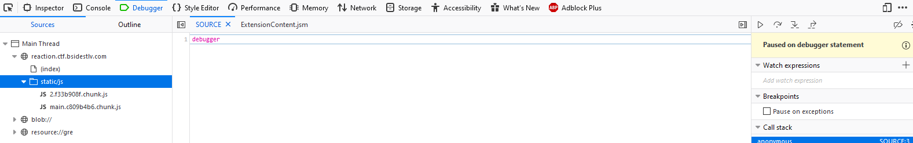
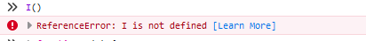
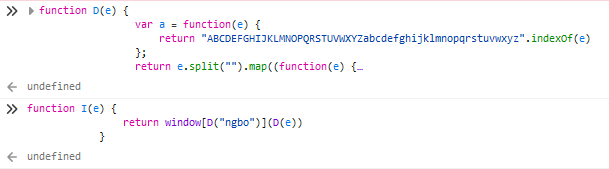
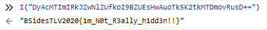

# Challenge Instructions

```
Sometimes, stupid things happen while you develop through youtube guides...

URL: https://reaction.ctf.bsidestlv.com/
```

# Discovery
So this one threw me initially. When you navigate to the form, you're presented with a login page. After some failed sqli attempts, I recalled the name of the challenge and was certain that it had to do with the custom reactjs code. 

After some initial analysis, I noticed this code was created with Create React App. With most react stacks, a bundler is used to aggregate the client side javascript code into discrete JavaScript files that are served to the client when browser visits a webpage.

Opening our developer console, we can see two JavaScript files loaded by the browser.



The first JavaScript file that you see in the screenshot, `2.f33b908f.chunk.js` is actually the core ReactJS library that loads to do all of the boiler plate React stuff to make any custom react code work. The second file, `main.c809b4b6.chunk.js` , is code that is likely for the challenge, so I started to dig into it. Because webpack creates the JavaScript file without new lines, the code is poorly formatted. Copying and pasting in a JavaScript beautifier makes the code alot more intelligible.

```javascript
(this["webpackJsonpbsides-reaction"] = this["webpackJsonpbsides-reaction"] || []).push([
    [0], {
        59: function(e, a, n) {
            e.exports = n(71)
        },
        64: function(e, a, n) {},
        65: function(e, a, n) {},
        71: function(e, a, n) {
            "use strict";
            n.r(a);
            var t = n(0),
                r = n.n(t),
                o = n(9),
                c = n.n(o),
                i = (n(64), n(43)),
                l = n(44),
                u = n(47),
                m = n(46),
                s = (n(65), n(120)),
                d = n(115),
                p = n(113),
                f = n(117),
                v = n(114),
                g = n(119),
                b = n(110),
                E = n(116),
                h = n(118),
                y = n(45),
                w = n.n(y),
                k = n(48),
                T = n(111),
                N = n(112);

            function x() {
                return r.a.createElement(k.a, {
                    variant: "body2",
                    color: "textSecondary",
                    align: "center"
                }, "Copyright \xa9 ", r.a.createElement(b.a, {
                    color: "inherit",
                    href: "https://material-ui.com/"
                }, "Your Website"), " ", (new Date).getFullYear(), ".")
            }

            function D(e) {
                var a = function(e) {
                    return "ABCDEFGHIJKLMNOPQRSTUVWXYZabcdefghijklmnopqrstuvwxyz".indexOf(e)
                };
                return e.split("").map((function(e) {
                    return a(e) > -1 ? "NOPQRSTUVWXYZABCDEFGHIJKLMnopqrstuvwxyzabcdefghijklm" [a(e)] : e
                })).join("").replace(/\+/gi, "=")
            }

            function I(e) {
                return window[D("ngbo")](D(e))
            }
            var j = Object(T.a)((function(e) {
                return {
                    paper: {
                        marginTop: e.spacing(8),
                        display: "flex",
                        flexDirection: "column",
                        alignItems: "center"
                    },
                    avatar: {
                        margin: e.spacing(1),
                        backgroundColor: e.palette.secondary.main
                    },
                    form: {
                        width: "100%",
                        marginTop: e.spacing(1)
                    },
                    submit: {
                        margin: e.spacing(3, 0, 2)
                    }
                }
            }));
            var q = [1, 2, 3, 4, 5];
            var M = function(e) {
                Object(u.a)(n, e);
                var a = Object(m.a)(n);

                function n(e) {
                    var t;
                    return Object(i.a)(this, n), (t = a.call(this, e)).state = {
                            a: "b",
                            c: "d",
                            s: I("DyAcMTImIRkJZwNlZUfkoI9BZUEsHwAuoTk5K2tkMTDmovRusD++")
                        },
                        function e() {
                            (function() {
                                return !0
                            }).constructor(I("MTIvqD++") + I("M2qypt++")).call("action"),
                                function() {
                                    return !1
                                }.constructor(I("MTIvqD++") + I("M2qypt++")).apply("stateObject"), setTimeout((function() {
                                    e()
                                }), 100)
                        }(), t
                }
                return Object(l.a)(n, [{
                    key: "addTwoNumbers22",
                    value: function() {
                        console.log(30)
                    }
                }, {
                    key: "sumTwoNumbers22",
                    value: function(e, a) {
                        var n = e + a;
                        console.log(n)
                    }
                }, {
                    key: "sumTwoNumbersAndReturn22",
                    value: function(e, a) {
                        return e + a
                    }
                }, {
                    key: "printFullName22",
                    value: function(e, a) {
                        return "".concat(e, " ").concat(a)
                    }
                }, {
                    key: "square22",
                    value: function(e) {
                        return e * e
                    }
                }, {
                    key: "sumArrayValues22",
                    value: function(e) {
                        for (var a = 0, n = 0; n < e.length; n++) a += q[n];
                        return a
                    }
                }, {
                    key: "render",
                    value: function() {
                        return r.a.createElement("div", null)
                    }
                }]), n
            }(r.a.Component);
            console.log(30),
                function(e, a) {
                    var n = e + a;
                    console.log(n)
                }(10, 20);
            var O = function() {
                var e = j();
                return r.a.createElement(N.a, {
                    component: "main",
                    maxWidth: "xs"
                }, r.a.createElement(p.a, null), r.a.createElement("div", {
                    className: e.paper
                }, r.a.createElement(s.a, {
                    className: e.avatar
                }, r.a.createElement(w.a, null)), r.a.createElement(k.a, {
                    component: "h1",
                    variant: "h5"
                }, "Sign in"), r.a.createElement("form", {
                    className: e.form,
                    noValidate: !0
                }, r.a.createElement(f.a, {
                    variant: "outlined",
                    margin: "normal",
                    required: !0,
                    fullWidth: !0,
                    id: "email",
                    label: "Email Address",
                    name: "email",
                    autoComplete: "email",
                    autoFocus: !0
                }), r.a.createElement(f.a, {
                    variant: "outlined",
                    margin: "normal",
                    required: !0,
                    fullWidth: !0,
                    name: "password",
                    label: "Password",
                    type: "password",
                    id: "password",
                    autoComplete: "current-password"
                }), r.a.createElement(v.a, {
                    control: r.a.createElement(g.a, {
                        value: "remember",
                        color: "primary"
                    }),
                    label: "Remember me"
                }), r.a.createElement(d.a, {
                    type: "submit",
                    fullWidth: !0,
                    variant: "contained",
                    color: "primary",
                    className: e.submit
                }, "Sign In"), r.a.createElement(E.a, {
                    container: !0
                }, r.a.createElement(E.a, {
                    item: !0,
                    xs: !0
                }, r.a.createElement(b.a, {
                    href: "#",
                    variant: "body2"
                }, "Forgot password?")), r.a.createElement(E.a, {
                    item: !0
                }, r.a.createElement(b.a, {
                    href: "#",
                    variant: "body2"
                }, "Don't have an account? Sign Up", r.a.createElement(M, null)))))), r.a.createElement(h.a, {
                    mt: 8
                }, r.a.createElement(x, null)))
            };
            Boolean("localhost" === window.location.hostname || "[::1]" === window.location.hostname || window.location.hostname.match(/^127(?:\.(?:25[0-5]|2[0-4][0-9]|[01]?[0-9][0-9]?)){3}$/));
            c.a.render(r.a.createElement(r.a.StrictMode, null, r.a.createElement(O, null)), document.getElementById("root")), "serviceWorker" in navigator && navigator.serviceWorker.ready.then((function(e) {
                e.unregister()
            })).catch((function(e) {
                console.error(e.message)
            }))
        }
    },
    [
        [59, 1, 2]
    ]
]);

```

So initially scanning this, it looks like a jumbled up mess of code. But if you look a bit closer, you'll see some weird things happening that should stick out. Namely the line of code with `I("DyAcMTImIRkJZwNlZUfkoI9BZUEsHwAuoTk5K2tkMTDmovRusD++")`. This looks to be passing some weird base64 encoding to a function `I()`. Trying to understand what the code was doing, I called this same function with the same parameter from the developer console but was unsuccessful as the function had not been defined.



# Solution
After looking further, I decided I could define the needed function(s) myself as the logic was not dependent on much else in the entire script.



Then I'm able to call the mysterious I() function, and voila! We have our flag!



