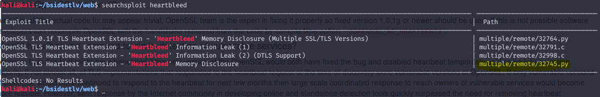
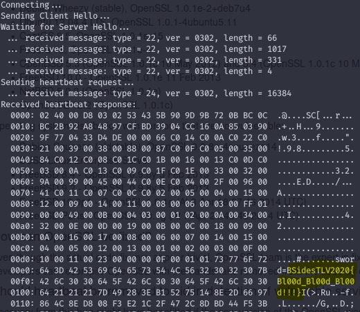

# Challenge Instructions
```
I have never met a vampire, I don't know what might happen tomorrow. "The strength of the vampire is that people will not believe in him". There's no set-in-stone way to be a vampire, especially with the evil ones.

URL: https://vampires.ctf.bsidestlv.com:8001/
Bruteforce is not the answer!
```

# Discovery

Well, I hate to admit this but I had a harder time with this one than I should have, especially just passing my OSCP. The challenge has a bunch of references and allusions to vampires and blood. I mean, there may be 20 or so references starting from the name of the challenge to the web page that is just screaming to tell you what the solution to this is. In addition to this, if you're using any modern web browser, you're smacked with a security warning when trying to navigate to the initial page crying about the self-signed SSL cert.

# Solution
These all pointed to signs of the Heartbleed vulnerability, which is a bug in the OpenSSL cryptographic software libraries that was discovered in 2014. Any SSL communication that is still using these libraries may be vulnerable to the Heatbleed exploit, which allows attackers to read the memory of the server that is communicating through SSL/TLS. Of course, xkcd has a great comic that describes at a high level what an attacker is able to achieve through this bug. [Check it out here.](https://xkcd.com/1354/)

From my experience on hackthebox.eu and OSCP, I know there is a nice little python script in searchsploit that allows someone to easily check for heartbleed and also reads some memory and reports it back.



Running this script shows the server is indeed vulnerable to heartbleed, and after a few attempts, it shows our flag hidden in some residual memory from an HTTP request from the login form to the server.

